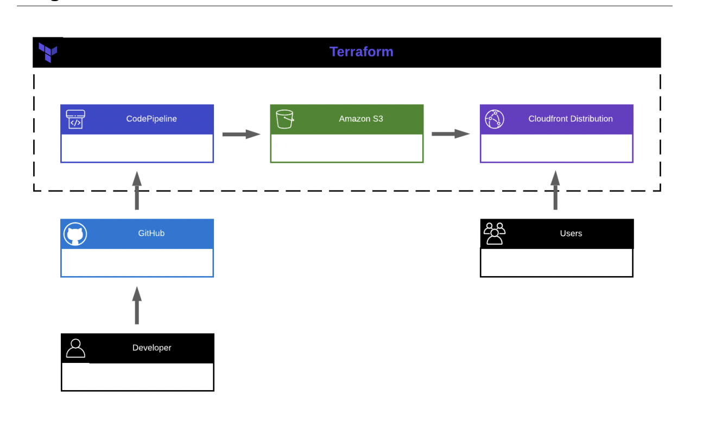

# st-terraform

Terraform repository that contains a stack that deploys an static website based on a private s3 with Cloudfront, and a CI/CD pipeline that works on CodePipeline.

## Description

The stack accomplish the following requirements

- The infrastructure should be codified using Terraform and provisioned in such a way that it can be redeployed to a different account with minor variable changes. :heavy_check_mark:

- S3 should be configured as a static site and used to host the content. :heavy_check_mark:

- Amazon CloudFront should be configured to distribute the content from the S3
static site. :heavy_check_mark:

- Amazon CloudFront’s default behavior should be configured to not cache. :heavy_check_mark:

- Amazon CloudFront should have an additional behavior configured to cache an
image for a default / minimum / maximum TTL = 30 minutes. :heavy_check_mark:

- Amazon CloudFront should have SSL enabled using the Default CloudFront Certificate :heavy_check_mark:

- CodePipeline should be configured in such a way to deploy / update the files for the site. :heavy_check_mark:

- CodePipeline should trigger off any commits or pull requests merged to a specific
branch of the site’s source code git repository. :heavy_check_mark:

- CodePipeline should invalidate the CloudFront Distribution after adding files to the site. :heavy_check_mark:

## Project Diagram

## Requirements

*WARNING* 

It's important to make the connect between CodeStar-Connections and GitHub before launch first pipeline run, if not, pipeline doesn't work properly. Source:  [Terraform Docs](https://registry.terraform.io/providers/hashicorp/aws/latest/docs/resources/codestarconnections_connection)

| Name | Version |
|------|---------|
| [terraform](https://www.terraform.io/)| >= v0.14.11 |
## Providers

| Name | Version |
|------|---------|
|  [aws](#provider\_aws) | >= 3.56 |

## Resources

| Name | Type |
|------|------|
| [aws_cloudfront_distribution.s3_distribution](https://registry.terraform.io/providers/hashicorp/aws/latest/docs/resources/cloudfront_distribution) | resource |
| [aws_cloudfront_origin_access_identity.s3_web_bucket](https://registry.terraform.io/providers/hashicorp/aws/latest/docs/resources/cloudfront_origin_access_identity) | resource |
| [aws_codepipeline.website_pipeline](https://registry.terraform.io/providers/hashicorp/aws/latest/docs/resources/codepipeline) | resource |
| [aws_codestarconnections_connection.github](https://registry.terraform.io/providers/hashicorp/aws/latest/docs/resources/codestarconnections_connection) | resource |
| [aws_iam_role.codepipeline_role](https://registry.terraform.io/providers/hashicorp/aws/latest/docs/resources/iam_role) | resource |
| [aws_s3_bucket.web_bucket](https://registry.terraform.io/providers/hashicorp/aws/latest/docs/resources/s3_bucket) | resource |
| [aws_caller_identity.current](https://registry.terraform.io/providers/hashicorp/aws/latest/docs/data-sources/caller_identity) | data source |
| [aws_cloudfront_cache_policy.no-cache](https://registry.terraform.io/providers/hashicorp/aws/latest/docs/data-sources/cloudfront_cache_policy) | data source |
| [aws_iam_policy_document.assume_role_codepipeline](https://registry.terraform.io/providers/hashicorp/aws/latest/docs/data-sources/iam_policy_document) | data source |
| [aws_iam_policy_document.codepipeline_role_policy](https://registry.terraform.io/providers/hashicorp/aws/latest/docs/data-sources/iam_policy_document) | data source |
| [aws_iam_policy_document.s3_policy](https://registry.terraform.io/providers/hashicorp/aws/latest/docs/data-sources/iam_policy_document) | data source |

## Inputs

| Name | Description | Type | Default | Required |
|------|-------------|------|---------|:--------:|
|  [bucket\_name](#input\_bucket\_name) | n/a | `string` | n/a | yes |
|  [pipeline\_name](#input\_pipeline\_name) | n/a | `string` | n/a | yes |
|  [region](#input\_region) | AWS Region to deploy infrastructure on it | `string` | n/a | yes |
|  [web\_repo\_name](#input\_web\_repo\_name) | n/a | `string` | n/a | yes |

## Outputs

| Name | Description |
|------|-------------|
|  [cloudfront\_endpoint](#output\_cloudfront\_endpoint) | n/a |
|  [s3\_website\_endpoint](#output\_s3\_website\_endpoint) | n/a |

---
author: Alejandro Bejarano
---